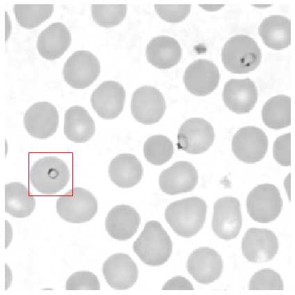
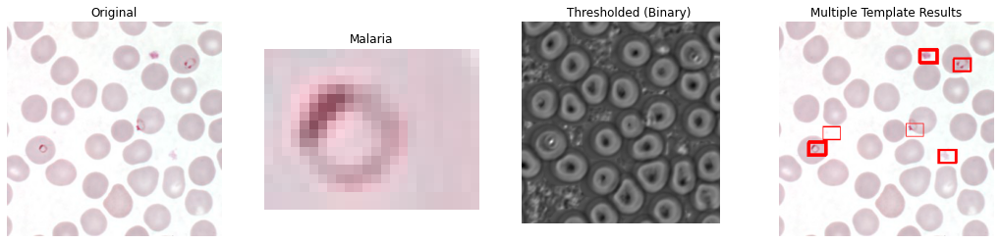
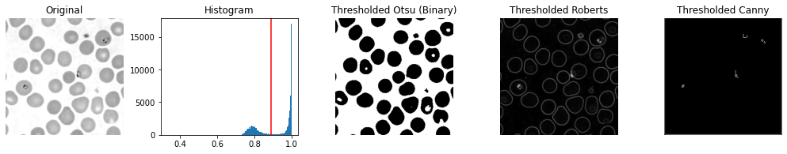
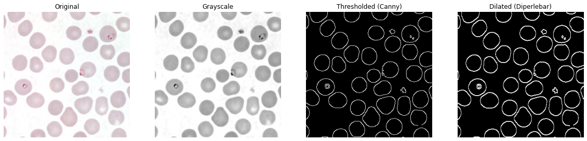

# Malaria Recognition

by M. Attala R.

>This project contains about how malaria can be detected in red blood cells using 4 methods, namely:

1. Matching templates
2. Multiple Matching Templates
3. Thresholding
4. Total Red Blood Cells (in the picture)

The dataset used is in the form of images, namely:

  

and for the result as follows:

## Template Matching

Using libraries:
- numpy
- matplotlib
- skimage

  

## Multiple Template Matching

Using libraries:
- numpy
- matplotlib
- cv2/opencv

  

## Thresholding

Using libraries:
- skimage
- matplotlib

  

## Total Red Blood Cells

Using libraries:
- cv2
- matplotlib

  

  